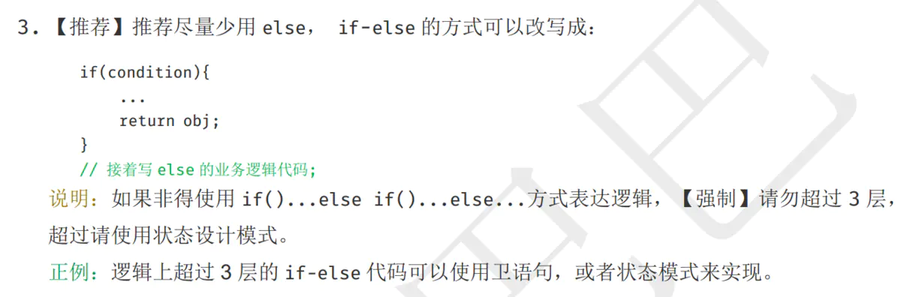

# 状态模式

举一个简单的例子。商品库存中心有个最基本的需求是减库存和补库存，我们看看怎么用状态模式来写。

核心在于，我们的关注点不再是 Context 是该进行哪种操作，而是关注在这个 Context 会有哪些操作。

定义状态接口：
```
public interface State {
    public void doAction(Context context);
}
```

实现接口：
```
// 减库存
public class DeductState implements State {

    public void doAction(Context context) {
        System.out.println("商品卖出，准备减库存");
        context.setState(this);

        //... 执行减库存的具体操作
    }

    public String toString() {
        return "Deduct State";
    }
} 

// 补库存
public class RevertState implements State {

    public void doAction(Context context) {
        System.out.println("给此商品补库存");
        context.setState(this);

        //... 执行加库存的具体操作
    }

    public String toString() {
        return "Revert State";
    }
}
```

前面用到了 context.setState(this)，我们来看看怎么定义 Context 类：
```
public class Context {
    private State state;
      private String name;
      public Context(String name) {
        this.name = name;
    }

      public void setState(State state) {
        this.state = state;
    }
      public void getState() {
        return this.state;
    }
}
```

我们来看下客户端调用，大家就一清二楚了：
```
public static void main(String[] args) {
    // 我们需要操作的是 iPhone X
    Context context = new Context("iPhone X");

    // 看看怎么进行补库存操作
      State revertState = new RevertState();
      revertState.doAction(context);

    // 同样的，减库存操作也非常简单
      State deductState = new DeductState();
      deductState.doAction(context);

    // 如果需要我们可以获取当前的状态
    // context.getState().toString();
}
```

读者可能会发现，在上面这个例子中，如果我们不关心当前 context 处于什么状态，那么 Context 就可以不用维护 state 属性了，那样代码会简单很多。
不过，商品库存这个例子毕竟只是个例，我们还有很多实例是需要知道当前 context 处于什么状态的。


再来一个例子。

我们考虑设计一个金库警报系统，这个系统会根据白天晚上做出不同的响应。

有一个金库
金库与警报中心相连
金库里有警铃和电话
金库里有时钟

金库只能在白天使用
白天使用金库，会在警报中心留下记录
晚上使用金库，会向警报中心发送紧急事态通知

警铃白天晚上都能用
使用警铃，会向警报中心发送紧急事态通知

电话都可以使用
白天使用电话，会呼叫警报中心
晚上使用电话，会呼叫警报中心的留言电话

基本就是以上的需求逻辑。

如果我们不使用状态模式
那就是大概伪码如下：
```
使用金库调用的方法（） ｛
  if(白天) {
} else if(晚上) {
}
｝

正常通话时（） ｛
if（白天） ｛｝
else if(晚上) ｛
｝
｝
```
显然这样可以实现，也并没有什么错误。

但是状态模式确实从不同的角度来考虑问题。

状态模式会发现，这些不同的行为，主要依赖于两个状态，就是白天和晚上。
所以状态模式会抽象出这两种状态，每个状态就会有自己的行为实现，比如白天这个状态会实现自己的使用金库的方法，通话的方法，晚上的类也会实现自己的行为逻辑，最后我们只要取得状态对象的委托调用他们的方法就行了，不管他们具体是怎么实现的。
我们看一下使用状态模式的伪码：
```
白天的状态类 {
      使用金库的方法
      使用警铃的方法
     通话的方法
}


晚上的状态类 {
      使用金库的方法
      使用警铃的方法
     通话的方法
}
```

我们看到普通方法和状态模式的区别就是状态模式中，定义了状态类，就不需要if语句来判断了。
所以当我们遇到很多个if else语句的时候，往往可以考虑状态模式，阿里最新的java开发手册里面就有一条相关的推荐


具体实现代码写在代码文件。