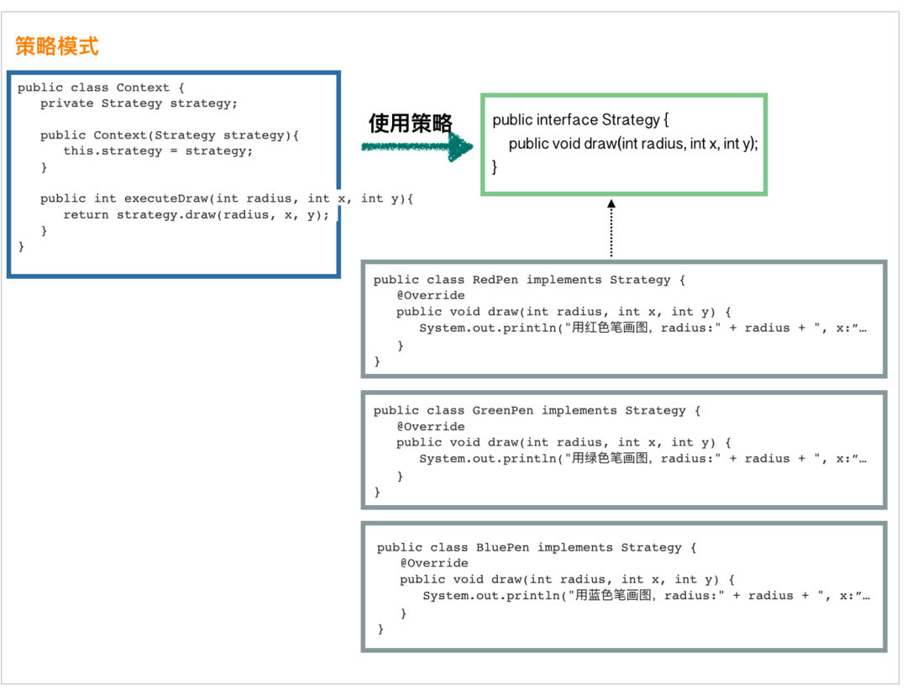
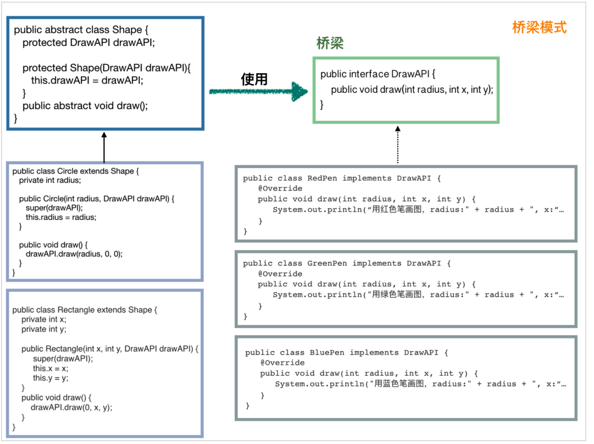

# 策略模式

场景比较简单，我们需要画一个图形，可选的策略就是用红色笔来画，还是绿色笔来画，或者蓝色笔来画。

首先，先定义一个策略接口：
```
public interface Strategy {
   public void draw(int radius, int x, int y);
}
```

定义具体的几个策略：
```
public class RedPen implements Strategy {
   @Override
   public void draw(int radius, int x, int y) {
      System.out.println("用红色笔画图，radius:" + radius + ", x:" + x + ", y:" + y);
   }
}
public class GreenPen implements Strategy {
   @Override
   public void draw(int radius, int x, int y) {
      System.out.println("用绿色笔画图，radius:" + radius + ", x:" + x + ", y:" + y);
   }
}
public class BluePen implements Strategy {
   @Override
   public void draw(int radius, int x, int y) {
      System.out.println("用蓝色笔画图，radius:" + radius + ", x:" + x + ", y:" + y);
   }
}
```

使用策略的类：
```
public class Context {
   private Strategy strategy;

   public Context(Strategy strategy){
      this.strategy = strategy;
   }

   public int executeDraw(int radius, int x, int y){
      return strategy.draw(radius, x, y);
   }
}
```

客户端演示：
```
public static void main(String[] args) {
    Context context = new Context(new BluePen()); // 使用蓝色笔来画
      context.executeDraw(10, 0, 0);
}
```

放到一张图上，让大家看得清晰些：


这个时候，大家有没有联想到结构型模式中的桥梁模式，它们其实非常相似，我把桥梁模式的图拿过来大家对比下：


要我说的话，它们非常相似，桥梁模式在左侧加了一层抽象而已。桥梁模式的耦合更低，结构更复杂一些。