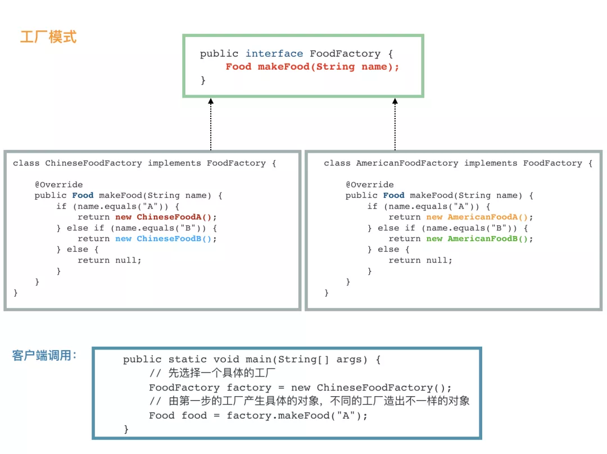

# 工厂模式
简单工厂模式很简单，如果它能满足我们的需要，我觉得就不要折腾了。之所以需要引入工厂模式，是因为我们往往需要使用两个或两个以上的工厂。
```java
public interface FoodFactory {
    Food makeFood(String name);
}

public class ChineseFoodFactory implements FoodFactory {
    @Override
    public Food makeFood(String name) {
        if (name.equals("noodle")) {
            LanZhouNoodle noodle = new LanZhouNoodle();
            noodle.setName("好吃的兰州拉面");
            noodle.setSpicy(10);
            return noodle;
        } else if (name.equals("chicken")) {
            HuangMenChicken chicken = new HuangMenChicken();
            chicken.setName("有家黄焖鸡面");
            chicken.setCondiment("马铃薯");
            return chicken;
        } else {
            return null;
        }
    }
}

public class AmericanFoodFactory implements FoodFactory {
    @Override
    public Food makeFood(String name) {
        if (name.equals("hanbao")) {
            Hamburger hanbao = new Hamburger();
            hanbao.setName("汉堡王汉堡真难吃");
            hanbao.setKetchup(false);
            return hanbao;
        } else if (name.equals("chicken")) {
            RoastTurkey huoji = new RoastTurkey();
            huoji.setName("感恩节烤火鸡");
            huoji.setDegreeOfCooked(8);
            return huoji;
        } else {
            return null;
        }
    }
}
```

客户端调用：
```java
public class Run {
    public static void main(String[] args) {
        // 先选择一个具体的工厂
        FoodFactory chineseFoodFactory = new ChineseFoodFactory();
        // 由第一步的工厂产生具体的对象，不同的工厂造出不一样的对象
        Food chineseChicken = chineseFoodFactory.makeFood("chicken");
        System.out.println(chineseChicken);

        FoodFactory americanFoodFactory = new AmericanFoodFactory();
        Food americanChicken = americanFoodFactory.makeFood("chicken");
        System.out.println(americanChicken);
    }
}
```
虽然都是调用 makeFood("chicken") 制作 chicken 类食物，但是，不同的工厂生产出来的完全不一样。

第一步，我们需要选取合适的工厂，然后第二步基本上和简单工厂一样。  
**核心在于，我们需要在第一步选好我们需要的工厂。** 比如，我们有 LogFactory 接口，实现类有 FileLogFactory 和 KafkaLogFactory，分别对应将日志写入文件和写入 Kafka 
中，显然，我们客户端第一步就需要决定到底要实例化 FileLogFactory 还是 KafkaLogFactory，这将决定之后的所有的操作。
