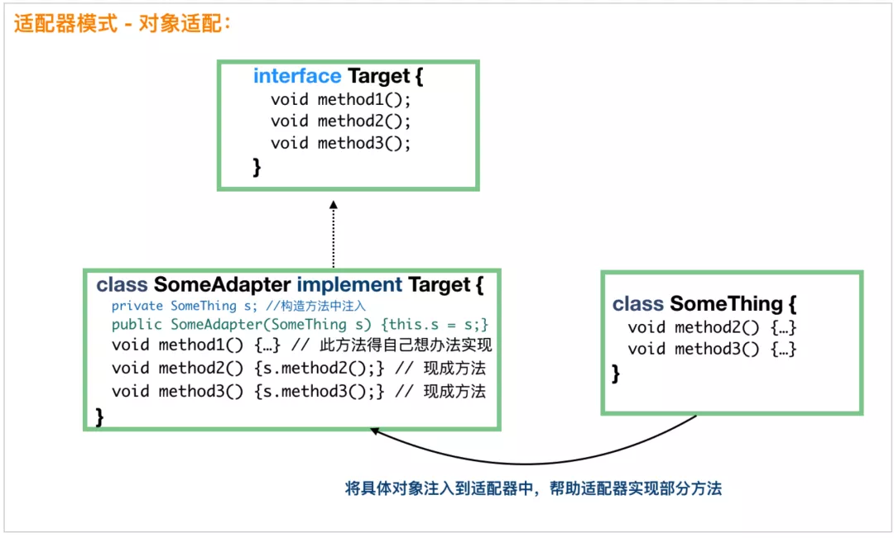

# 对象适配器模式
来看一个《Head First 设计模式》中的一个例子，我稍微修改了一下，看看怎么将鸡适配成鸭，这样鸡也能当鸭来用。因为，现在鸭这个接口，我们没有合适的实现类可以用，所以需要适配器。
```
public interface Duck {
    public void quack(); // 鸭的呱呱叫
    public void fly(); // 飞
}

public interface Cock {
    public void gobble(); // 鸡的咕咕叫
    public void fly(); // 飞
}

public class WildCock implements Cock {
    public void gobble() {
        System.out.println("咕咕叫");
    }
    public void fly() {
        System.out.println("鸡也会飞哦");
    }
}
```
鸭接口有 fly() 和 quare() 两个方法，鸡 Cock 如果要冒充鸭，fly() 方法是现成的，但是鸡不会鸭的呱呱叫，没有 quack() 方法。这个时候就需要适配了：
```
// 毫无疑问，首先，这个适配器肯定需要 implements Duck，这样才能当做鸭来用
public class CockAdapter implements Duck {

    Cock cock;
    // 构造方法中需要一个鸡的实例，此类就是将这只鸡适配成鸭来用
      public CockAdapter(Cock cock) {
        this.cock = cock;
    }

    // 实现鸭的呱呱叫方法
    @Override
      public void quack() {
        // 内部其实是一只鸡的咕咕叫
        cock.gobble();
    }

      @Override
      public void fly() {
        cock.fly();
    }
}
```
客户端调用很简单了：
```
public static void main(String[] args) {
    // 有一只野鸡
      Cock wildCock = new WildCock();
      // 成功将野鸡适配成鸭
      Duck duck = new CockAdapter(wildCock);
      ...
}
```
到这里，大家也就知道了适配器模式是怎么回事了。无非是我们需要一只鸭，但是我们只有一只鸡，这个时候就需要定义一个适配器，由这个适配器来充当鸭，但是适配器里面的方法还是由鸡来实现的。  
我们用一个图来简单说明下：
