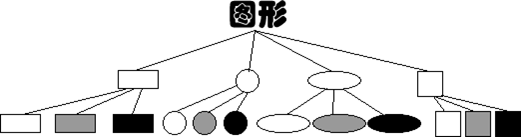
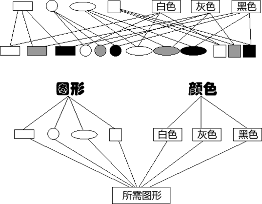
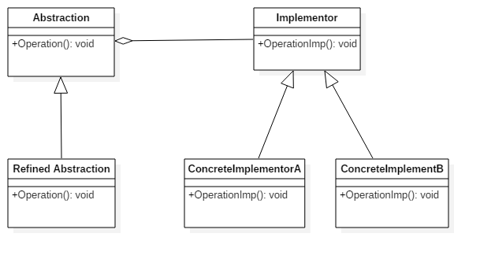

# 桥梁模式

## 例子1
现需要提供大中小3种型号的画笔，能够绘制5种不同颜色，如果使用蜡笔，我们需要准备3*5=15支蜡笔，也就是说必须准备15个具体的蜡笔类。
而如果使用毛笔的话，只需要3种型号的毛笔，外加5个颜料盒，用3+5=8个类就可以实现15支蜡笔的功能。
实际上，**蜡笔和毛笔的关键一个区别就在于笔和颜色是否能够分离**。

## 例子2
设想如果要绘制矩形、圆形、椭圆、正方形，我们至少需要4个形状类，但是如果绘制的图形需要具有不同的颜色，  
如红色、绿色、蓝色等，此时至少有如下两种设计方案：  
第一种设计方案是为每一种形状都提供一套各种颜色的版本。  
  
这种设计方案就是类似于实例一中的蜡笔，颜色和形状紧密结合起来，必须为每一种形状准备各种颜色的版本，加入我们现在要求加入一种颜色蓝色，
那么每一种形状都需要修改，所以这种设计方案的缺点是显而易见的，一是不符合“开-闭”原则，二是需要的类非常多，编码重复性较高。

第二种设计方案是根据实际需要对形状和颜色进行组合。  
  
上下两部分图是分别从不同的角度描述这种方案，上边的图说的是如何利用形状和颜色进行组合，下边的图说的是各个类的继承和组合关系。
第二种方案需要为所有的图形声明一个共同的父类，为所有的颜色声明一个父类，两个父类各有自己的具体实现，
我们需要的产品就是有两种具体的产品进行组合得到的。这样在加入新的颜色或者形状的时候不用修改其他的类，而且大大的减少了代码量。
而这第二种方案就是我们今天要讨论的桥梁模式。

## 什么是桥梁模式
上边的蜡笔和图形的例子他们都有一个共同的特点就是他们都有两个变化因素，蜡笔是粗细和形状，图形是形状和颜色，
不管是毛笔还是图形的第二种解决方案他们比较好的原因都是将这两种变化因素分开了，使得两种因素可以独立的变化。
蜡笔的颜色和蜡笔本身是分不开的，所以就造成必须使用15支色彩、大小各异的蜡笔来绘制图画。
而毛笔与颜料能够很好的分开，各自独立变化，便简化了操作。
> 所以桥梁模式的用意是"将抽象化与实现化脱耦，使得二者可以独立地变化。"

那么什么是脱耦呢？我们先来看一下什么是耦合。两个类之间的关系分为两种，一种是强关联一种是弱关联，
强关联是在编译时期就已经确定的，无法在运行时期动态的改变的关联；弱关联是可以动态地确定并且可以在运行时期动态改变的关联。
显然，Java中继承是强关联而聚合是弱关联。耦合就是两个实体的行为的某种强关联，脱耦就是指将他们之间的强关联解除，
但是在桥梁模式中是指将它们之间的强关联改换成弱关联。所以桥梁模式的精髓就是尽量使用聚合/组合来实现弱关联。

## 桥梁模式的结构

这是具有一般性的桥梁模式的类图，我们可以看到桥梁模式一共有四部分组成：

- 抽象化角色：抽象化给出的定义，并保存一个对实现化对象的引用，就是图像类中的形状父类。
- 修正抽象化角色：扩展抽象化角色，改变和修正父类对抽象化的定义，比如形状下有正方形，圆形等图形。
- 实现化角色：这个角色给出具体角色的接口，但是不给出具体的实现，这个接口不一定和抽象化角色的接口定义相同，实际上两者可以完全不一样，好比形状的颜色接口。
- 具体实现化角色：这个角色给出实现化角色接口的具体实现，好比各种具体的颜色。

如果将Abstraction和Implementor看成两个岸边的话，那么聚合关系就像桥一样将他们连接起来，这就是这个模式为什么叫桥梁模式的原因。

## 桥梁模式的优缺点
### 优点 
1. 分离抽象接口及其实现部分。
2. 桥梁模式提高了系统的可扩充性，在两个变化维度中任意扩展一个维度，都不需要修改原有系统。
3. 实现细节对客户透明，可以对用户隐藏实现细节。
### 缺点
1. 桥梁模式的使用会增加系统的理解与设计难度，由于关联关系建立在抽象层，要求开发者一开始就针对抽象层进行设计与编程。
2. 桥梁模式要求正确识别出系统中两个独立变化的维度，因此其使用范围具有一定的局限性，如何正确识别两个独立维度也需要一定的经验积累。