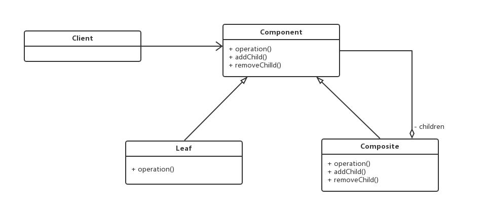
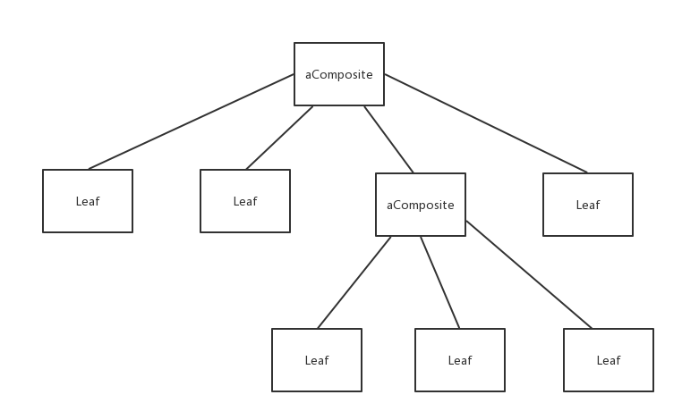

# 组合模式

定义：将对象组合成树形结构以表示“部分-整体”的层次结构。组合模式使得用户对待单个对象或组合对象的使用具有一致性。

举个很常见的例子：文件系统

文件系统由文件和目录组成，每个文件里装有内容，而每个目录的内容可以有文件和目录，
目录就相当于是由单个对象或组合对象组合而成，如果你想要描述的是这样的数据结构，那么你就可以使用组合模式。

类图表示：


组成元素：
1. 抽象构件角色(Component )：是组合中对象声明接口，实现所有类共有接口的默认行为。
2. 树叶构件角色(Leaf)：上述提到的单个对象，叶节点没有子节点。
3. 树枝构件角色(Composite)：定义有子部件的组合部件行为，存储子部件，在Component接口中实现与子部件有关的操作。
4. 客户端(Client)：使用 Component 部件的对象。

通过上面的组合模式就可以构建出这样的数据结构：


直接上代码。
抽象构件:
```
abstract class Component {
    public abstract void operation();
    public void add(Component c) {
	throw new UnsupportedOperationException();
    }
    public void remove(Component c) {
	throw new UnsupportedOperationException();
    }
    public Component getChild(int i) {
	throw new UnsupportedOperationException();
    }
}
```

UnsupportedOperationException 是为了 Leaf 在继承之后不用重写该方法，因为这些方法是 Composite 对象需要重写的，而单个对象不需要。

Leaf 类：
```
class ConcreteComponent1 extends Component {
    public void operation() {
	System.out.println("operation of concrete component 1 ");
    }
}

class ConcreteComponent2 extends Component {
    public void operation() {
	System.out.println("operation of concrete component 2 ");
    }
}

class ConcreteComponent3 extends Component {
    public void operation() {
	System.out.println("operation of concrete component 3 ");
    }
}
```

组合类：
```
class Composite extends Component {
    private ArrayList<Component> children;
    public Composite() {
	children = new ArrayList<Component>();
    }
    public void operation() {
	for(Component child: children) {
	    child.operation();
	}
    }

    public void add(Component c) {
	children.add(c);
    }

    public void remove(Component c) {
	children.remove(c);
    }

    public Component getChild(int i) {
	return children.get(i);
    }
}
```

客户端调用：
```
public class Client {
    public static void main(String[] args) {
	Component c1 = new ConcreteComponent1();
	Component c2 = new ConcreteComponent2();
	Component c3 = new ConcreteComponent3();

	Component c = new Composite();
	c.add(c1);
	c.add(c2);
	c.add(c3);
	c.operation();

	c.remove(c2);
	c.operation();
    }
}
```

**适用性**：
1. 你想表示对象的部分-整体层次结构
2. 你希望用户忽略组合对象与单个对象的不同，用户将统一地使用组合结构中的所有对象。

**组合模式与之前讲的装饰器模式很像，都是通过在类中存储成员变量来完成一些功能上的扩展，那么它们之间有什么不同呢？**
- 每一个装饰器类只有含有一个组件，即没有对象聚合，而每个组合类可以含有多个组件，即 Composite。
- 装饰器模式倾向于在原有对象的基础上添加新的功能，组合模式倾向于对原有对象的功能进行组合使用。

考虑下面的场景：

你被要求开发一个简单的图形库。初始要求是：

- 图形库必须能够处理基础图形，如线和圆。
- 图形库必须允许复合和基础图形的递归复合，以便绘图可以由多种图形组成。
- 需要提供操作以允许添加，移除，显示和图形组件。

思路很清晰，图形分为基础图形和组合图形，用组合模式再合适不过了。
基本代码放在代码文件里，这里就不再重复放一个模式的代码了